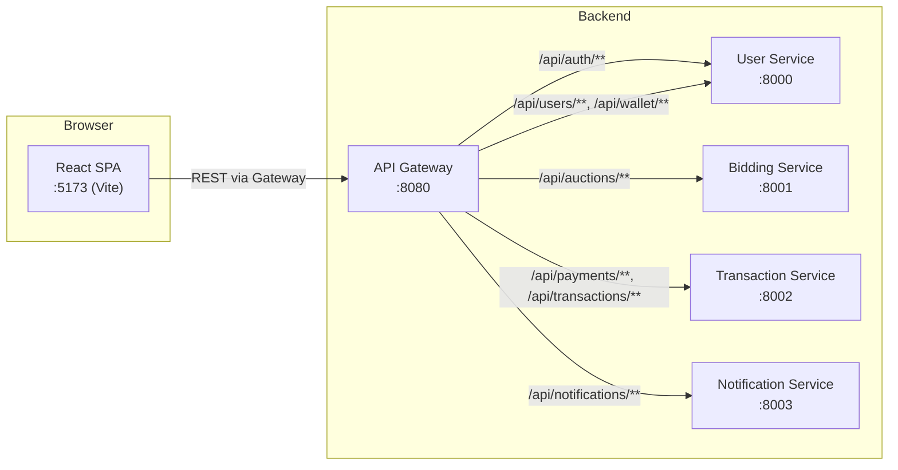
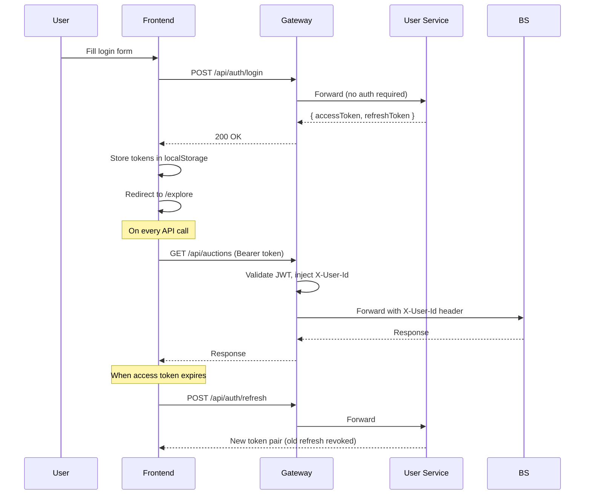
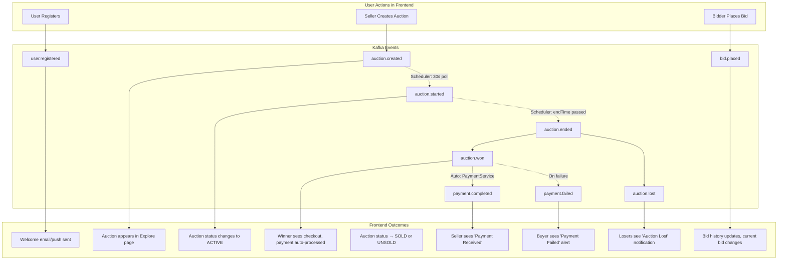
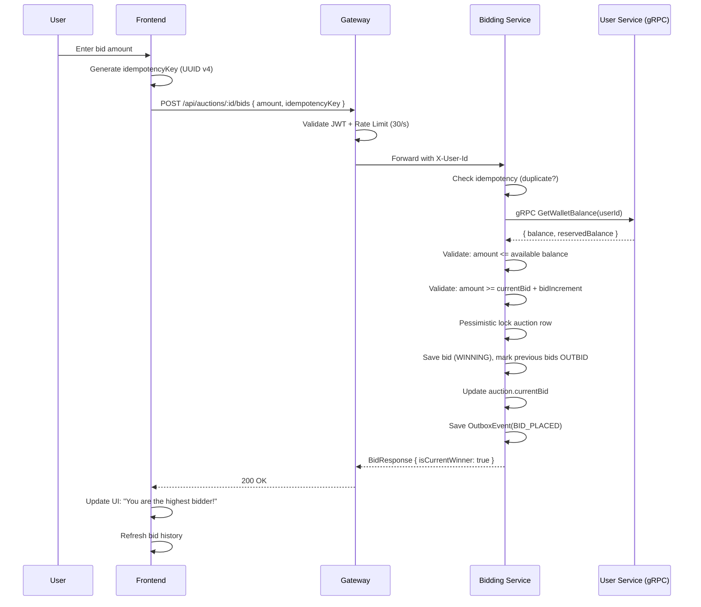
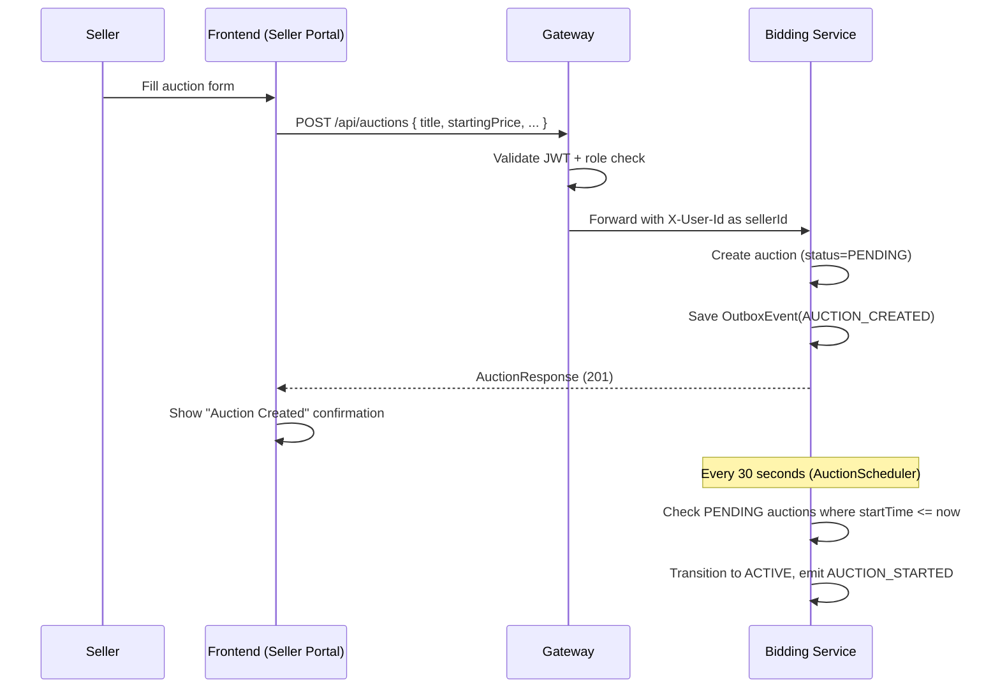
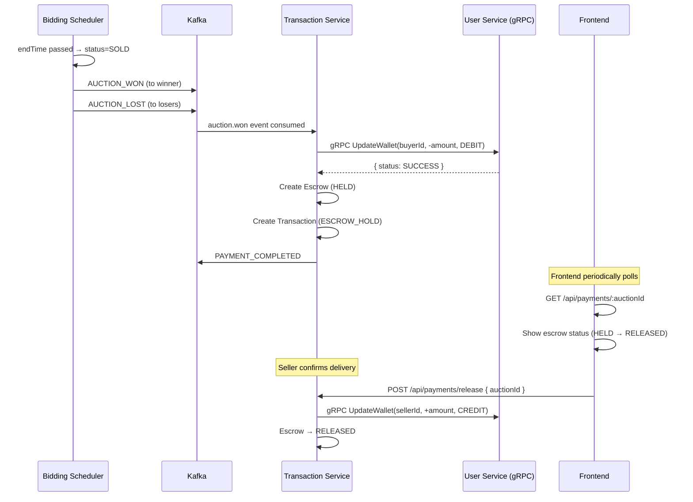
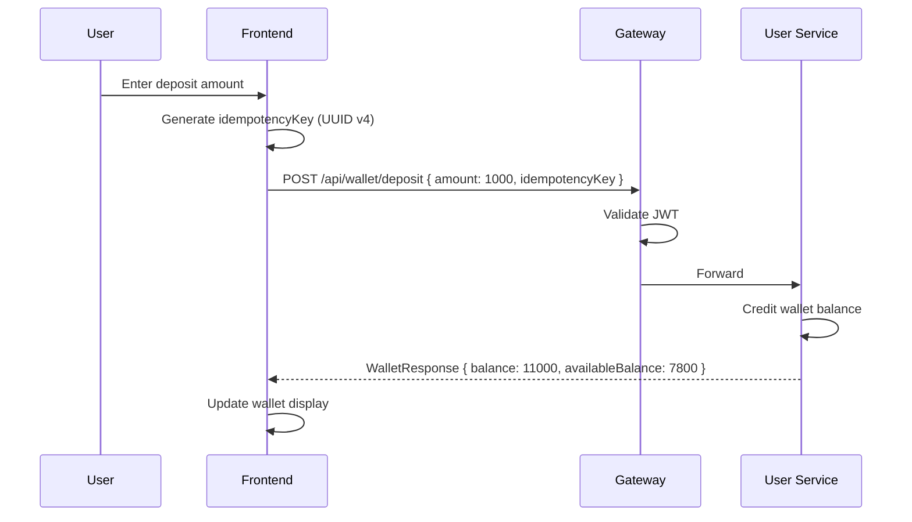

# VaultX — Frontend Architecture & Workflow Reference

> A complete blueprint for designing the VaultX frontend, derived from inspecting every backend controller, DTO, Kafka event, gRPC service, and gateway route in the codebase.

---

## 1. System Context — How the Frontend Fits



**Base URL**: `http://localhost:8080` (API Gateway)

**CORS Origins Allowed**: `http://localhost:5173`, `http://localhost:3000`

---

## 2. Authentication Flow

### 2.1 Token Architecture

| Token | Type | Lifetime | Storage |
|---|---|---|---|
| **Access Token** | JWT (HMAC-SHA) | 15 minutes (900,000 ms) | `localStorage` or memory |
| **Refresh Token** | Opaque UUID string | 7 days | `localStorage` |

### 2.2 Auth Endpoints (Public — No JWT Required)

#### `POST /api/auth/register`
```json
// Request
{
  "username": "string (3-50 chars, required)",
  "email": "string (valid email, required)",
  "password": "string (8-100 chars, required)",
  "fullName": "string (optional)"
}

// Response (201 Created)
{
  "accessToken": "eyJhbGciOiJIUzI1NiJ9...",
  "refreshToken": "a5f3e2d1-...",
  "expiresIn": 900000,
  "tokenType": "Bearer"
}
```

#### `POST /api/auth/login`
```json
// Request
{
  "email": "string (required)",
  "password": "string (8-100 chars, required)"
}

// Response (200 OK) — same shape as register
```

#### `POST /api/auth/refresh`
```json
// Request
{ "refreshToken": "a5f3e2d1-..." }

// Response (200 OK) — new token pair, old refresh token is revoked
```

### 2.3 Auth Header Format
All protected endpoints require:
```
Authorization: Bearer <accessToken>
```
The gateway validates the JWT and injects `X-User-Id` and `X-User-Role` headers to downstream services.

### 2.4 Frontend Auth Flow



---

## 3. Complete REST API Reference

### 3.1 User Service (`/api/users`, `/api/wallet`)

| Method | Path | Auth | Description | Request Body | Response |
|---|---|---|---|---|---|
| `GET` | `/api/users/me` | ✅ JWT | Get current user profile | — | `UserResponseDTO` |
| `PATCH` | `/api/users/me` | ✅ JWT | Update profile | `UserUpdateRequestDTO` | `UserResponseDTO` |
| `DELETE` | `/api/users/me` | ✅ JWT | Delete account | — | 204 No Content |
| `GET` | `/api/wallet` | ✅ JWT | Get wallet balance | — | `WalletResponse` |
| `POST` | `/api/wallet/deposit` | ✅ JWT | Deposit funds | `WalletDepositRequest` | `WalletResponse` |

**DTO Shapes:**

```typescript
interface UserResponse {
  id: string;          // UUID
  username: string;
  email: string;
  fullName: string;
  phone: string | null;
  kycStatus: 'PENDING' | 'VERIFIED';
  userRating: number;  // BigDecimal
  role: 'USER' | 'SELLER' | 'ADMIN';
  createdAt: string;   // ISO datetime
}

interface UserUpdateRequest {
  fullName?: string;
  phone?: string;
}

interface WalletResponse {
  id: string;              // UUID
  userId: string;          // UUID
  balance: number;         // BigDecimal
  reservedBalance: number; // BigDecimal
  availableBalance: number; // balance - reservedBalance
  currency: string;        // "USD"
}

interface WalletDepositRequest {
  amount: number;          // min 0.01
  idempotencyKey: string;  // client-generated UUID to prevent duplicate deposits
}
```

---

### 3.2 Bidding Service (`/api/auctions`)

| Method | Path | Auth | Description | Request | Response |
|---|---|---|---|---|---|
| `GET` | `/api/auctions` | ❌ Public | List auctions | `?status=ACTIVE` | `AuctionResponse[]` |
| `GET` | `/api/auctions/:id` | ❌ Public | Auction details | — | `AuctionResponse` |
| `POST` | `/api/auctions` | ✅ JWT | Create auction (sellers) | `AuctionRequest` | `AuctionResponse` (201) |
| `GET` | `/api/auctions/:id/bids` | ❌ Public | Bid history | — | `BidResponse[]` |
| `POST` | `/api/auctions/:id/bids` | ✅ JWT | Place bid | `BidRequest` | `BidResponse` |
| `GET` | `/api/auctions/:id/bids/mine` | ✅ JWT | My bids on auction | — | `BidResponse[]` |

> **Note**: GET auction routes go through gateway WITHOUT JWT (`bidding-service-public` route). POST/PUT routes go through the `bidding-service-secure` route WITH JWT + rate limiting (30 req/s sustained, 60 burst).

**DTO Shapes:**

```typescript
interface AuctionRequest {
  title: string;             // required, non-blank
  description?: string;
  startingPrice: number;     // required, min 0.01
  reservePrice?: number;     // min 0.01
  bidIncrement: number;      // required, min 0.01
  startTime: string;         // ISO datetime, required
  endTime: string;           // ISO datetime, required
  extensionPeriodSeconds?: number; // default 120
  currency?: string;         // default "USD"
}

interface AuctionResponse {
  id: string;                // UUID
  title: string;
  description: string;
  sellerId: string;          // UUID
  startingPrice: number;
  reservePrice: number | null;
  currentBid: number | null;
  bidIncrement: number;
  status: 'PENDING' | 'ACTIVE' | 'SOLD' | 'UNSOLD';
  startTime: string;
  endTime: string;
  extendedAt: string | null;
  extensionPeriodSeconds: number;
  currency: string;
  createdAt: string;
}

interface BidRequest {
  amount: number;            // required, min 0.01
  maxAutoBid?: number;       // optional auto-bid ceiling
  idempotencyKey: string;    // required, client-generated UUID
}

interface BidResponse {
  id: string;                // UUID
  auctionId: string;         // UUID
  bidderId: string;          // UUID
  amount: number;
  maxAutoBid: number | null;
  isAutoBid: boolean;
  status: 'WINNING' | 'OUTBID';
  currentHighestBid: number;
  isCurrentWinner: boolean;
  createdAt: string;
}
```

---

### 3.3 Transaction Service (`/api/payments`)

| Method | Path | Auth | Description | Request | Response |
|---|---|---|---|---|---|
| `GET` | `/api/payments/:auctionId` | ✅ JWT | Get payment/escrow status | — | `PaymentStatus` |
| `POST` | `/api/payments/release` | ✅ JWT | Release escrow to seller | `{ auctionId: UUID }` | `{ status, auctionId }` |
| `POST` | `/api/payments/refund` | ✅ JWT | Refund escrow to buyer | `{ auctionId: UUID }` | `{ status, auctionId }` |

```typescript
interface PaymentStatus {
  auctionId: string;
  status: 'HELD' | 'RELEASED' | 'REFUNDED';
  amount: number;
  buyerId: string;
  sellerId: string;
  createdAt: string;
}
```

---

### 3.4 Notification Service (`/api/notifications`)

| Method | Path | Auth | Description | Request | Response |
|---|---|---|---|---|---|
| `GET` | `/api/notifications` | ✅ JWT | List notifications | `?page=0&size=20` | `NotificationResponse[]` |
| `GET` | `/api/notifications/unread-count` | ✅ JWT | Unread count | — | `{ unread: number }` |
| `PUT` | `/api/notifications/preferences/:eventType` | ✅ JWT | Update preference | `PreferenceUpdateRequest` | `{ status: "UPDATED" }` |
| `POST` | `/api/notifications/request` | ✅ JWT | Send custom notification | `NotificationRequest` | `{ status: "QUEUED", requestId }` |

```typescript
interface NotificationResponse {
  id: string;
  eventType: string;
  channel: 'EMAIL' | 'SMS' | 'PUSH';
  title: string;
  message: string;
  status: 'SENT' | 'FAILED';
  createdAt: string;
  sentAt: string | null;
}

interface PreferenceUpdateRequest {
  channel: 'EMAIL' | 'SMS' | 'PUSH';
  enabled: boolean;
}
```

---

## 4. Event-Driven Workflows (Kafka)

These are backend-only flows, but the frontend should reflect their outcomes via polling or real-time updates.



### Notification Event Types (for preference management)

| Event Type | Channels | Trigger |
|---|---|---|
| `USER_REGISTERED` | EMAIL, PUSH | User signs up |
| `AUCTION_CREATED` | EMAIL, PUSH | Seller creates auction |
| `AUCTION_STARTED` | PUSH | Scheduler activates auction |
| `BID_PLACED` | PUSH | User places bid |
| `AUCTION_WON` | EMAIL, SMS, PUSH | Auction ends, winner determined |
| `AUCTION_LOST` | PUSH | Auction ends, losers notified |
| `PAYMENT_COMPLETED` | EMAIL, PUSH | Escrow released to seller |
| `PAYMENT_FAILED` | EMAIL | Wallet debit fails |

---

## 5. Frontend Page Architecture

### 5.1 Existing Routes

| Route | Page | Auth Required | Backend APIs Used |
|---|---|---|---|
| `/` | Landing / Home | Conditional | — |
| `/login` | Login | ❌ | `POST /api/auth/login` |
| `/register` | Register | ❌ | `POST /api/auth/register` |
| `/explore` | Auction Marketplace | ❌ (browse) | `GET /api/auctions?status=ACTIVE` |
| `/auction/:id` | Auction Detail | ❌ view, ✅ bid | `GET /api/auctions/:id`, `GET .../bids`, `POST .../bids` |
| `/wallet` | Wallet Management | ✅ | `GET /api/wallet`, `POST /api/wallet/deposit` |
| `/transactions` | Transaction History | ✅ | `GET /api/payments/:auctionId` |
| `/seller` | Seller Portal | ✅ (SELLER role) | `POST /api/auctions`, `GET /api/auctions?sellerId=me` |
| `/checkout` | Post-Win Checkout | ✅ | `GET /api/payments/:auctionId`, `POST /api/payments/release` |

### 5.2 Recommended Frontend Architecture

```
frontend/src/
├── api/
│   ├── client.ts          # Axios/fetch wrapper with JWT interceptor + refresh
│   ├── auth.ts            # login, register, refresh, logout
│   ├── users.ts           # getMe, updateMe, deleteMe
│   ├── wallet.ts          # getWallet, deposit
│   ├── auctions.ts        # getAll, getById, create
│   ├── bids.ts            # placeBid, getBids, getMyBids
│   ├── payments.ts        # getStatus, release, refund
│   └── notifications.ts   # getAll, unreadCount, updatePreference
├── hooks/
│   ├── useAuth.ts         # Auth context + token management
│   ├── useAuction.ts      # Auction polling + state
│   ├── useWallet.ts       # Wallet balance state
│   ├── useNotifications.ts # Notification polling
│   └── useCountdown.ts    # Auction timer (already exists)
├── components/
│   ├── TopNav.tsx         # Global nav with wallet + notifications
│   ├── CountdownTimer.tsx # Already exists
│   ├── AuctionCard.tsx    # Reusable auction card
│   ├── BidPanel.tsx       # Bid placement form
│   ├── BidHistory.tsx     # Bid list for an auction
│   ├── NotificationBell.tsx # Bell icon with unread count
│   └── ProtectedRoute.tsx # Route guard for auth
├── pages/
│   ├── Landing.tsx        # Marketing landing
│   ├── Login.tsx          # Login form
│   ├── Register.tsx       # Register form
│   ├── Home.tsx           # Dashboard for logged-in users
│   ├── Explore.tsx        # Browse active auctions
│   ├── AuctionDetail.tsx  # Full auction view + bidding
│   ├── Wallet.tsx         # Balance, deposit, history
│   ├── Transactions.tsx   # Payment/escrow history
│   ├── SellerPortal.tsx   # Seller's auction management
│   └── Checkout.tsx       # Post-win payment confirmation
├── context/
│   └── AuthContext.tsx    # Global auth state provider
├── types/
│   └── index.ts           # All TypeScript interfaces
├── utils/
│   ├── format.ts          # Currency, date formatters
│   └── idempotency.ts     # UUID v4 key generator
├── App.tsx
├── main.tsx
└── index.css
```

---

## 6. Key Frontend Workflows

### 6.1 Bidding Workflow



### 6.2 Auction Creation (Seller)



### 6.3 Post-Auction Payment (Automatic)



### 6.4 Wallet Deposit Workflow



---

## 7. Critical Frontend Implementation Notes

### 7.1 Idempotency Keys
Every mutating request (bid placement, deposits) requires a **client-generated UUID** as `idempotencyKey`. Generate with:
```typescript
const idempotencyKey = crypto.randomUUID();
```
Store per-form-submission to prevent double submissions on retry.

### 7.2 JWT Token Refresh Strategy
```typescript
// Axios interceptor pattern
api.interceptors.response.use(
  response => response,
  async error => {
    if (error.response?.status === 401 && !error.config._retry) {
      error.config._retry = true;
      const { accessToken } = await refreshToken();
      error.config.headers.Authorization = `Bearer ${accessToken}`;
      return api(error.config);
    }
    return Promise.reject(error);
  }
);
```

### 7.3 Auction Polling Strategy
Since there are no WebSockets, use **adaptive polling**:
- **Auction ending in < 2 min**: Poll every **3 seconds**
- **Auction ending in < 30 min**: Poll every **10 seconds**
- **All other auctions**: Poll every **30 seconds**
- **Bid history**: Poll every **5 seconds** on active auction detail page

### 7.4 Rate Limiting Awareness
The gateway rate-limits bidding routes at **30 requests/second** (60 burst). Frontend should:
- Debounce bid buttons (prevent rapid clicking)
- Show a cooldown indicator if 429 is returned
- Queue auto-bid requests

### 7.5 Error Response Format
All backend errors return a consistent `ApiErrorResponse`:
```typescript
interface ApiError {
  status: number;      // 400, 401, 404, 409, 500
  error: string;       // "Validation Failed", "Unauthorized", etc.
  message: string;     // Human-readable detail
}
```

### 7.6 Demo Credentials (Seeded on Startup)
```
Email:    demo@vaultx.io
Password: Demo1234!
Role:     SELLER
Balance:  $10,000.00
```

---

## 8. Existing Frontend State (Current)

The current frontend uses **mock data** stored in `localStorage` via `api.ts`. To transition to real backend integration:

| Current (Mock) | Target (Real API) |
|---|---|
| `MOCK_USER` in localStorage | `GET /api/users/me` + `GET /api/wallet` |
| `MOCK_AUCTIONS` array | `GET /api/auctions` |
| `MOCK_BID_HISTORY` array | `GET /api/auctions/:id/bids` |
| `MOCK_TRANSACTIONS` array | `GET /api/payments/:auctionId` |
| `MOCK_SELLER_AUCTIONS` | `GET /api/auctions` (filter by current user) |
| `localStorage` auth check | JWT token validation |

### Tech Stack
- **React 18** + **TypeScript 5**
- **Vite 5** (dev server :5173)
- **TailwindCSS 3.4** (utility-first styling)
- **React Router v6** (client-side routing)
- No state management library (opportunity for Zustand or React Context)
