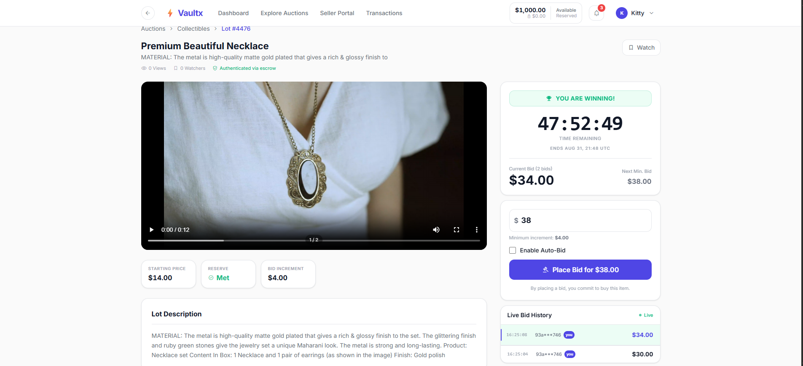
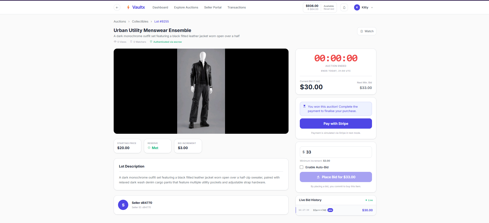
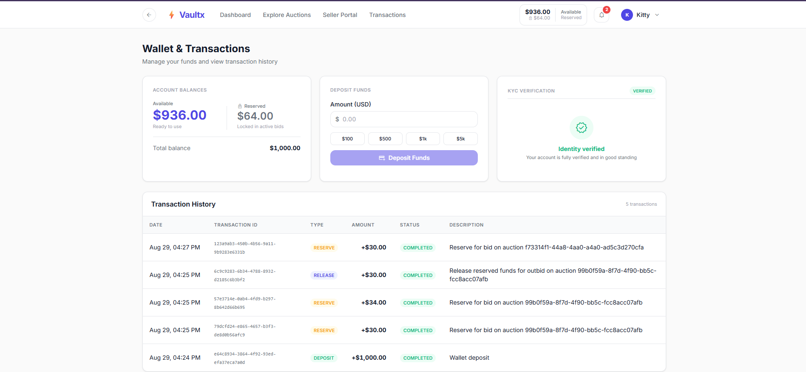
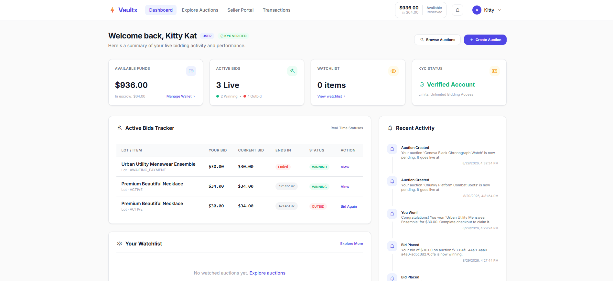
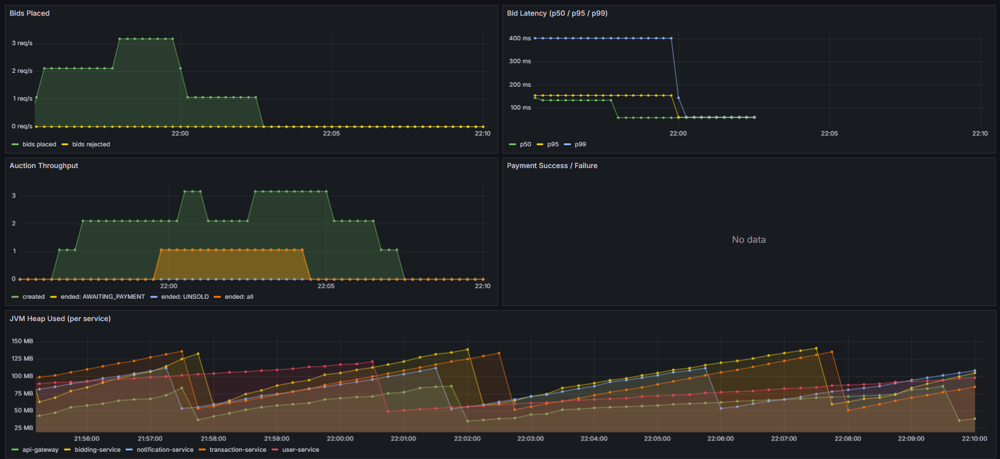
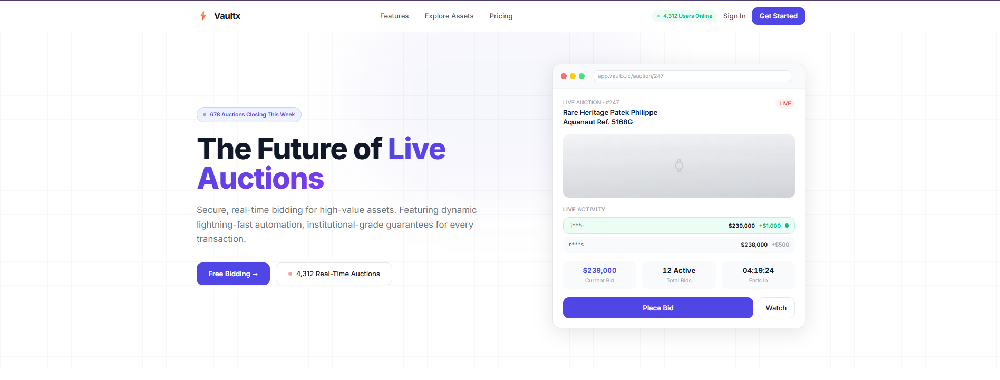

# Vaultx — Real-Time Bidding Platform

A production-grade, event-driven **Real-Time Bidding Platform** built with Java, Spring Boot 3, Apache Kafka, gRPC, and PostgreSQL. Buyers and sellers participate in live auctions with real-time bidding, wallet-based escrow, KYC verification, media uploads, and automated auction lifecycle management. Winner payments are settled online via **Stripe (test mode)**.

## Showcase

**Live auction with a video gallery, countdown, and real-time bidding:**


**Ended auction → Stripe-powered settlement & escrow ("Pay with Stripe"):**


**Wallet & escrow ledger (reserve/release/deposit) with KYC verification:**


**Buyer dashboard — active bids, available funds, and notifications:**


**Observability — Prometheus/Grafana (bid latency, auction throughput, JVM heap):**


**Landing page:**


## Architecture

```
┌────────────────────────────────────────────────────────────┐
│                   React SPA (Port 5173)                    │
└──────────────────────────┬─────────────────────────────────┘
                           │ REST
                           ▼
┌────────────────────────────────────────────────────────────┐
│                 API Gateway (Port 8080)                    │
│          Spring Cloud Gateway · JWT · Rate Limit · CORS    │
└───┬──────────────┬──────────────┬──────────────┬───────────┘
    │              │              │              │
    ▼              ▼              ▼              ▼
┌──────────┐  ┌──────────┐  ┌──────────┐  ┌──────────┐
│  User    │  │ Bidding  │  │Transact. │  │Notific.  │
│ Service  │  │ Service  │  │ Service  │  │ Service  │
│  :8000   │  │  :8001   │  │  :8002   │  │  :8003   │
│ gRPC:9000│  │ gRPC:9001│  │ gRPC:9002│  │  Kafka   │
└────┬─────┘  └────┬─────┘  └────┬─────┘  └────┬─────┘
     │             │             │             │
  PostgreSQL     PostgreSQL    PostgreSQL    PostgreSQL
    :5000          :5001         :5002         :5003
     │             │             │             │
     └─────────────┴─────┬───────┴─────────────┘
                         ▼
      Apache Kafka (KRaft) · Redis · LocalStack (S3)
                         │
               Zipkin · Prometheus · Grafana
```

## Tech Stack

| Layer | Technology |
|---|---|
| Backend | Java 17, Spring Boot 3.4.4 |
| Gateway | Spring Cloud Gateway (WebFlux/Netty) |
| Security | Spring Security, JWT (RS256), BCrypt |
| RPC | gRPC + Protocol Buffers |
| Messaging | Apache Kafka 7.6 (KRaft) + Confluent Schema Registry |
| Database | PostgreSQL 15 (one per service) |
| Cache | Redis 7 (rate limiting) |
| Object storage | LocalStack (S3-compatible) — presigned-URL media uploads |
| Payments | Stripe (`stripe-java`) — Checkout + webhooks (test mode) |
| Observability | Micrometer, Prometheus, Grafana, Zipkin, structured JSON logs |
| Frontend | React 18, TypeScript, Vite, Tailwind CSS |
| Build | Maven (multi-module, `mvnw` wrapper) |
| CI/CD | GitHub Actions |
| Deployment | Docker Compose |

## Microservices

| Service | Port | HTTP | gRPC | Responsibility |
|---|---|---|---|---|
| `api-gateway` | 8080 | ✅ | — | Routing, JWT validation, rate limiting, correlation IDs, security headers |
| `user-service` | 8000 | ✅ | 9000 | Auth, users, wallets, KYC, refresh tokens |
| `bidding-service` | 8001 | ✅ | 9001 | Auctions, bids, media, scheduler, archive, outbox → Kafka |
| `transaction-service` | 8002 | ✅ | 9002 | Stripe settlement, escrow, refunds (Saga) |
| `notification-service` | 8003 | ✅ | — | Kafka consumer, email/SMS/push simulation, preferences |

## Key Features

- **Microservices** with database-per-service isolation (zero shared databases, no cross-service FKs)
- **Event-driven** with the **transactional outbox pattern** → Kafka topics per event type, retry topics + DLQs
- **gRPC** for low-latency synchronous inter-service calls (wallet checks, profiles)
- **JWT RS256 auth** with refresh-token rotation; asymmetric signing
- **Optimistic + pessimistic locking** for concurrent bid safety; **idempotency keys** (UNIQUE constraints)
- **Media uploads** via **presigned S3 URLs** (direct-to-storage) with content-type + **magic-byte** validation, cover selection, per-auction limits
- **Payment-gated settlement**: auction ends → `AWAITING_PAYMENT` → **Stripe Checkout** → `SOLD` on payment; affordability-gated wallet debit with a **shortfall** flag for manual reconciliation
- **Escrow saga**: bid → win → hold → release/refund with compensation
- **Auction archive retention**: soft-archive finished auctions (`SOLD` 90d / `UNSOLD` 30d), hidden from listings and 404 on direct access
- **Rate limiting** via Redis (per-user sliding window)
- **Observability**: Prometheus metrics, Grafana dashboards, Zipkin tracing, correlation-ID JSON logs
- **KYC verification** flow; **CI pipeline** (GitHub Actions) + Testcontainers integration tests

## Auction Lifecycle

```
PENDING → ACTIVE → AWAITING_PAYMENT → SOLD  (payments settled via Stripe)
                                   ↘ UNSOLD (no winner / unpaid after 24h / payment failed)
Finished auctions are soft-archived after 90d (SOLD) / 30d (UNSOLD).
```

## Quick Start

### Prerequisites
- Docker + Docker Compose
- JDK 17 (for local dev)
- Maven (or the included `mvnw` wrapper)

### Run the full stack (Docker)

```bash
docker compose up --build
```

All **16 containers** start: 5 services + gateway, 4 PostgreSQL DBs, Kafka, Schema Registry, Redis, LocalStack, Zipkin, Prometheus, Grafana.

| Service | URL |
|---|---|
| API Gateway | http://localhost:8080 |
| Prometheus | http://localhost:9090 |
| Grafana | http://localhost:3000 (admin/admin) |
| Zipkin | http://localhost:9411 |
| LocalStack (S3) | http://localhost:4566 |

### Stripe (test mode)
Create a `.env` at the repo root (git-ignored) and set the keys, then restart `transaction-service`:

```
STRIPE_SECRET_KEY=sk_test_...
STRIPE_WEBHOOK_SECRET=whsec_...   # from `stripe listen --forward-to http://localhost:8080/api/payments/webhook`
STRIPE_CURRENCY=usd
CHECKOUT_SUCCESS_URL=http://localhost:5173/wallet
CHECKOUT_CANCEL_URL=http://localhost:5173/wallet
```

`docker compose up -d transaction-service` to apply. Settlement works via the Stripe **webhook**, and is also confirmed on redirect (`/api/payments/confirm`) — so it works even without `stripe listen`. Test card: `4242 4242 4242 4242`.

### Run services locally (infra in Docker)

```bash
docker compose up kafka schema-registry user-service-db bid-service-db tx-service-db notification-db redis localstack
# then run each service via IDE or:
./mvnw -pl user-service spring-boot:run
./mvnw -pl bidding-service spring-boot:run
./mvnw -pl transaction-service spring-boot:run
./mvnw -pl notification-service spring-boot:run
./mvnw -pl api-gateway spring-boot:run
```

### Run the frontend

```bash
cd frontend
npm install
npm run dev     # http://localhost:5173
```

## Demo User

A demo user is auto-seeded on user-service startup:

```
Email:    demo@vaultx.io
Password: Demo1234!
Role:     SELLER (KYC VERIFIED)
Wallet:   $10,000.00
```

> Register a second user to test bidding as a buyer (sellers can't bid on their own auctions).

## API Overview

All requests go through the gateway at `http://localhost:8080`. Protected routes require `Authorization: Bearer <accessToken>`.

### Auth & Users
| Method | Path | Auth |
|---|---|---|
| POST | `/api/auth/register` | — |
| POST | `/api/auth/login` | — |
| POST | `/api/auth/refresh` | — |
| GET | `/api/users/me` | 🔒 |
| PATCH | `/api/users/me` | 🔒 |
| DELETE | `/api/users/me` | 🔒 |
| GET | `/api/wallet` | 🔒 |
| POST | `/api/wallet/deposit` | 🔒 |

### Auctions & Bids
| Method | Path | Auth |
|---|---|---|
| POST | `/api/auctions` | 🔒 |
| GET | `/api/auctions` | — |
| GET | `/api/auctions/{id}` | — |
| GET | `/api/auctions/bids/mine` | 🔒 |
| POST | `/api/auctions/{id}/bids` | 🔒 |
| GET | `/api/auctions/{id}/bids` | — |
| GET | `/api/auctions/{id}/bids/mine` | 🔒 |

### Auction Media
| Method | Path | Auth |
|---|---|---|
| POST | `/api/auctions/{id}/media` | 🔒 (seller) |
| GET | `/api/auctions/{id}/media` | — |
| POST | `/api/auctions/{id}/media/{mediaId}/complete` | 🔒 (seller) |
| PUT | `/api/auctions/{id}/media/{mediaId}/cover` | 🔒 (seller) |
| DELETE | `/api/auctions/{id}/media/{mediaId}` | 🔒 (seller) |

### Payments
| Method | Path | Auth |
|---|---|---|
| GET | `/api/payments/{auctionId}/session` | 🔒 |
| POST | `/api/payments/confirm` | 🔒 |
| POST | `/api/payments/webhook` | — (Stripe) |
| POST | `/api/payments/release` | 🔒 |
| POST | `/api/payments/refund` | 🔒 |
| GET | `/api/payments/{auctionId}` | 🔒 |

### Watchlist & Notifications
| Method | Path | Auth |
|---|---|---|
| GET | `/api/watchlist` | 🔒 |
| POST | `/api/auctions/{id}/watchlist` | 🔒 |
| DELETE | `/api/auctions/{id}/watchlist` | 🔒 |
| GET | `/api/notifications` | 🔒 |
| GET | `/api/notifications/unread-count` | 🔒 |
| PUT | `/api/notifications/read` | 🔒 |
| PUT | `/api/notifications/preferences/{eventType}` | 🔒 |

**Example login:**
```bash
curl -X POST http://localhost:8080/api/auth/login \
  -H "Content-Type: application/json" \
  -d '{"email":"demo@vaultx.io","password":"Demo1234!"}'
```

## Project Structure

```
Vaultx/
├── pom.xml                      # Parent Maven (multi-module)
├── docker-compose.yml           # Full stack orchestration
├── prometheus.yml               # Metrics scrape config
├── grafana/                     # Dashboards + provisioning
├── localstack/                  # S3 bucket bootstrap (init-aws.sh)
├── .github/workflows/ci.yml     # CI pipeline
├── api-gateway/                 # Spring Cloud Gateway (JWT, rate limit, routing)
├── user-service/                # Auth, users, wallets, KYC
├── bidding-service/             # Auctions, bids, media, scheduler, archive
├── transaction-service/         # Stripe settlement, escrow, refunds
├── notification-service/        # Kafka consumer, channels, preferences
└── frontend/                    # React + Vite SPA
```

## Event Flow (Bid → Payment)

```
Bid placed → Bidding Service validates (gRPC) → saves bid + outbox
→ OutboxPoller → Kafka `bid.placed`
→ AuctionScheduler → auction ends → `AWAITING_PAYMENT` → Kafka `auction.won`
→ Transaction Service creates a Stripe Checkout Session (buyer pays online)
→ webhook/confirm (`checkout.session.completed`) → escrow HELD + `payment.completed`
→ Bidding Service (`payment.completed`) → auction SOLD (affordability-gated wallet debit)
→ POST /api/payments/release → credits seller → escrow RELEASED
→ Notification Service delivers email/SMS/push (simulated)
```

## Testing

```bash
# Unit tests per service
./mvnw -f user-service/pom.xml test           # 63 tests
./mvnw -f bidding-service/pom.xml test        # 70 tests
./mvnw -f transaction-service/pom.xml test
```

## Security Notes

- JWT is signed with **RS256** using an RSA keypair. The **private key is not committed** — generate/provide it via `JWT_PRIVATE_KEY_PATH` / `JWT_PUBLIC_KEY_PATH` env vars. Public keys are committed for the services to verify with.
- Passwords hashed with **BCrypt**; refresh tokens stored in DB with rotation + revocation.
- **Stripe keys** are supplied via git-ignored `.env` (never committed).
- Rate limiting, security headers, and CORS handled at the gateway; **magic-byte validation** on media uploads prevents spoofed content types.

## License

Private / educational portfolio project.
