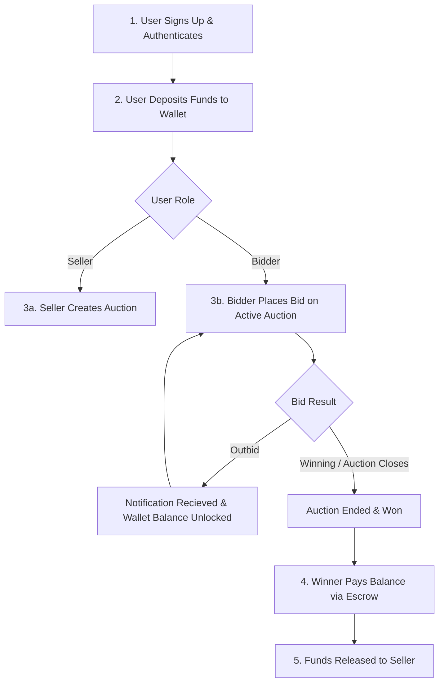
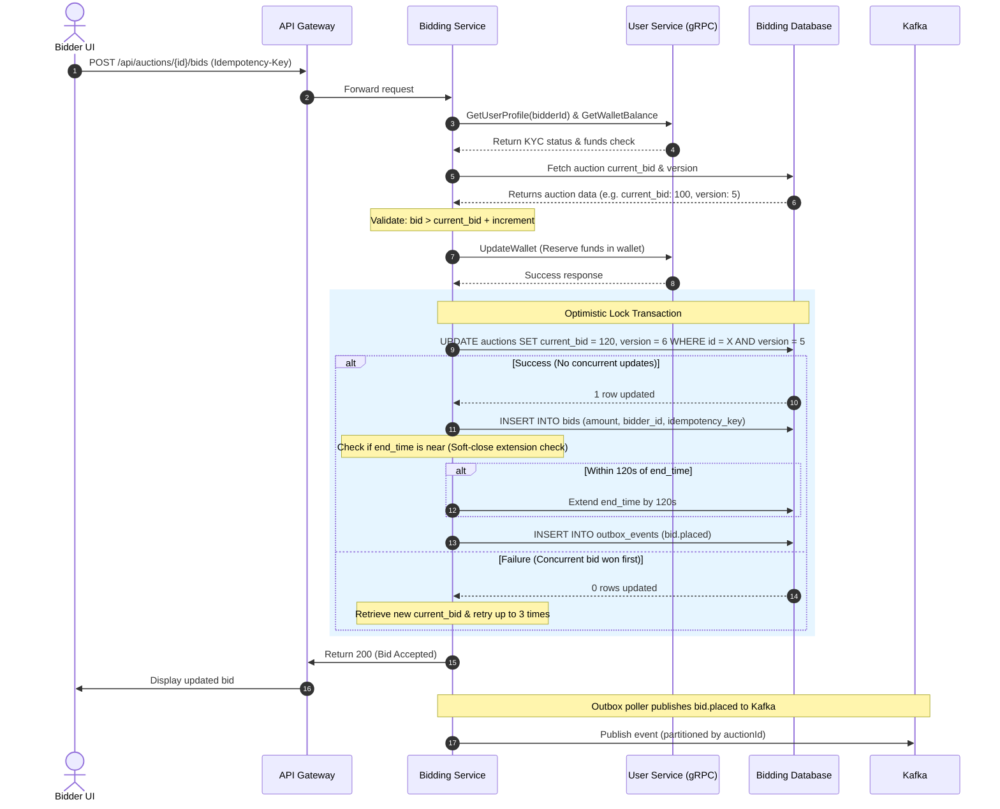

# Vaultx — End-to-End System Workflows

This document outlines both the **User Workflow** (the journey of buyers and sellers using Vaultx) and the **Program/System Workflow** (the coordination of microservices, databases, gRPC calls, and Kafka event streams under the hood).

---

## 1. User Workflow (The Journey)

The user journey spans registration, wallet loading, creating/monitoring auctions, bidding, winning/losing, and settlement.



---

## 2. Program & System Workflows (Under the Hood)

Here is how the microservices orchestrate each step of the lifecycle.

### Phase 1: User Registration & Onboarding

* **User Action:** User registers an account through the Client UI (`POST /api/auth/register`).
* **System Execution:**
  1. **API Gateway** intercepts the request, checks rate limits, injects a unique `Correlation-ID`, and routes the request to the **User Service**.
  2. **User Service** receives the request:
     - Hashes the password using `BCrypt` (strength 12).
     - Inserts the user record into the `users` table with status `PENDING` (KYC).
     - Automatically provisions an empty wallet for the user in the `wallets` table.
     - Inserts a `user.registered` event into the database via the **Transactional Outbox**.
  3. The **Outbox Poller** thread polls the outbox, reads the event, and publishes it to the Kafka `user-registered` topic.
  4. **Notification Service** consumes the Kafka event:
     - Resolves the user's phone/email via a **gRPC** `GetUserProfile` call to the **User Service**.
     - Sends a simulated onboarding email/SMS to the user.

---

### Phase 2: Wallet Loading & Funds Reservation

* **User Action:** Bidder deposits funds into their wallet.
* **System Execution:**
  1. The client sends a `POST /api/users/wallet/deposit` request with a client-generated `Idempotency-Key`.
  2. **User Service** verifies the idempotency key in the transactions repository.
     - If it's a new request, the service updates the wallet balance atomically in the database (`UPDATE wallets SET balance = balance + ? WHERE user_id = ?`).
     - Inserts a transaction record in the `transactions` table (status = `COMPLETED`).
  3. When the user later places a bid:
     - The **Bidding Service** initiates a **gRPC** `GetWalletBalance` check to ensure the user has enough money.
     - If yes, a **gRPC** `UpdateWallet` call is made to the **User Service** to move the bid amount from `balance` to `reserved_balance`. This guarantees that those funds cannot be spent concurrently elsewhere.

---

### Phase 3: Auction Creation

* **User Action:** A user with the `SELLER` role creates a new auction with a description, starting price, and end time.
* **System Execution:**
  1. Client sends `POST /api/auctions` to the gateway.
  2. **API Gateway** verifies the user's role claim from the JWT (verifying it is signed with the RS256 public key) and forwards the request to the **Bidding Service**.
  3. **Bidding Service**:
     - Performs a **gRPC** call `GetUserProfile` to the **User Service** to verify that the seller exists and is KYC verified.
     - Saves the auction details in the `auctions` table with status `PENDING` (scheduled to start at `start_time`).
     - Publishes an `auction.created` outbox event, which gets published to Kafka.
  4. The **Auction State Scheduler** background job in the **Bidding Service** runs periodically. When an auction reaches its start time, it updates the status to `ACTIVE` and emits `auction.started` to Kafka.

---

### Phase 4: Real-time Bidding Flow (Concurrent Bids & Soft-Close)

This is the most time-critical flow in the platform, optimized for high throughput and strong consistency.



---

### Phase 5: Auction Closure & Win Processing

* **System Execution:**
  1. The **Bidding Service** running the scheduler notices an auction has reached its `end_time` and has status `ACTIVE`.
  2. The service updates the status:
     - If the highest bid met the `reserve_price`, it updates status to `SOLD`.
     - Otherwise, it updates status to `UNSOLD`.
  3. It writes an `auction.ended` (and `auction.won` / `auction.lost` if sold) event to the outbox database, which is published to Kafka.
  4. The **Transaction Service** and **Notification Service** consume the `auction.won` event from Kafka:
     - **Transaction Service**:
       - Creates an Escrow record (`escrows` table) in a `HELD` state.
       - Invokes **gRPC** `UpdateWallet` on the **User Service** to move the winning bid amount from the buyer's `reserved_balance` to the transaction escrow.
     - **Notification Service**:
       - Resolves details of the winning bidder and the seller via **gRPC** `GetUserProfile`.
       - Sends email/SMS notifications ("You won the auction!" and "Your auction has sold!").

---

### Phase 6: Payment Completion & Settlement

Once the auction has closed and the winning funds are held in escrow:

* **User Action:** The winner proceeds to finalize checkout, or the physical delivery is confirmed, releasing the escrow.
* **System Execution:**
  1. Client sends a checkout release request.
  2. **Transaction Service**:
     - Verifies the escrow state (`HELD`).
     - Updates the escrow status to `RELEASED`.
     - Dispatches a **gRPC** call `UpdateWallet` to the **User Service** targeting the **Seller**:
       - Credits the seller's wallet `balance` with the escrow amount (minus any platform fees).
     - Emits a `payment.completed` event to the outbox database.
  3. The **Bidding Service** consumes `payment.completed` from Kafka to update the auction's record with official payment details.
  4. The **Notification Service** consumes `payment.completed` and alerts the seller that funds have been credited and the buyer that the transaction is settled.

---

### Phase 7: Notification Flow

A general-purpose notification engine operates entirely off of Kafka events.

```
┌─────────────┐
│  Any Svc    │──(Kafka Event)──▶ [ Kafka Topic ]
└─────────────┘                          │
                                         ▼
                               ┌───────────────────┐
                               │   Notification    │
                               │   Service Consumer│
                               └─────────┬─────────┘
                                         │
                                         ▼ (gRPC GetUserProfile)
                               ┌───────────────────┐
                               │   User Service    │
                               └─────────┬─────────┘
                                         │
                                         ▼ (Delivers info)
                               ┌───────────────────┐
                               │ SMS/Email Engine  │
                               └───────────────────┘
```

1. **Trigger:** Any service records an event (e.g., `user.registered`, `bid.placed`, `auction.won`, `wallet.credited`).
2. **Delivery:**
   - The event is published to Kafka.
   - **Notification Service** picks it up.
   - Using the event's `userId`, it calls the **User Service** via **gRPC** (`GetUserProfile`) to retrieve the user's primary communication channel (e.g., email address or phone number).
   - Generates a template message based on the event type (e.g., *"Your bid of $120.00 on Vintage Watch was outbid!"*).
   - Simulates the delivery and logs the notification status as `SENT` in the service's own PostgreSQL instance for historical auditing.
